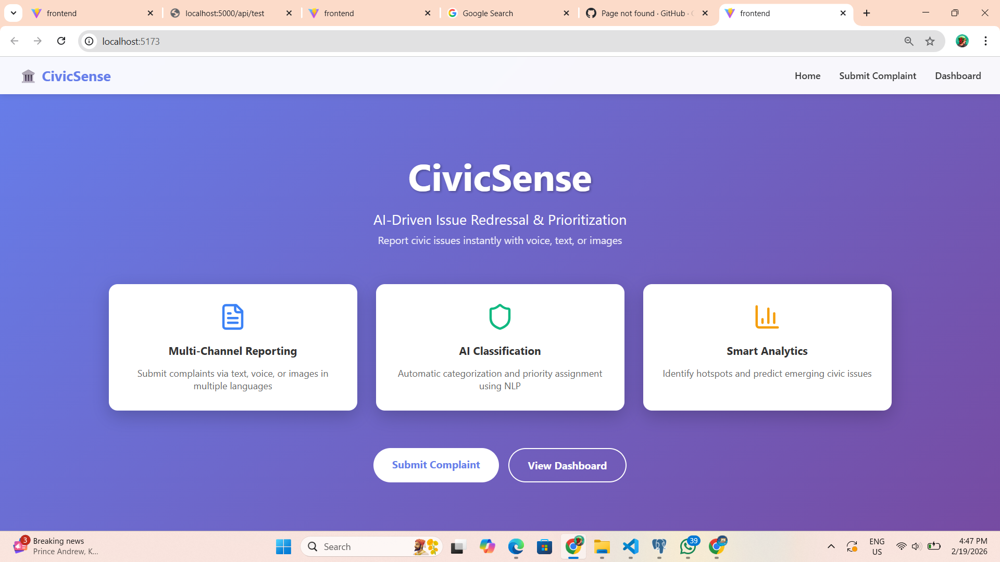
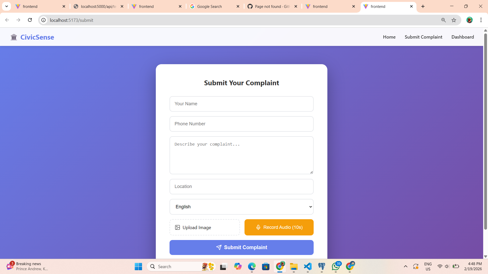
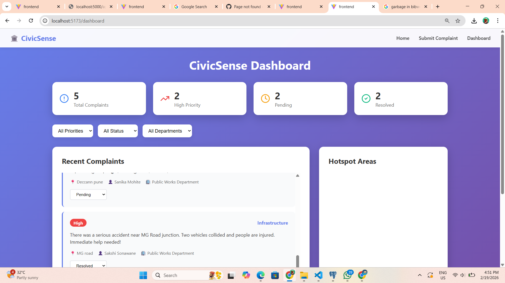
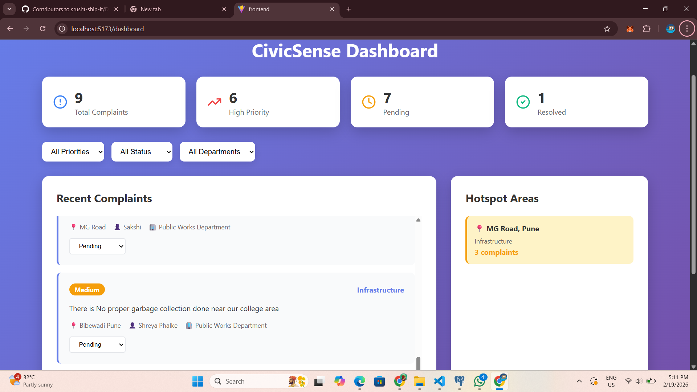

# CivicSense - AI-Driven Issue Redressal & Prioritization


## 📋 Project Overview

**CivicSense** is an intelligent civic complaint management system that leverages AI to automatically classify, prioritize, and route citizen grievances to the appropriate government departments. The system supports multi-channel input (text, voice, images) and provides predictive analytics to identify problem hotspots.

### Problem Statement
Citizens face difficulties in reporting civic issues, and government departments struggle with manual complaint categorization and prioritization. CivicSense automates this entire workflow using AI/NLP.

### Solution
An end-to-end platform that:
- Accepts complaints via text, voice recordings, or images
- Automatically classifies complaints into categories (Sanitation, Infrastructure, Safety)
- Analyzes urgency and assigns priority scores (High/Medium/Low)
- Routes complaints to the correct department
- Detects duplicate complaints
- Identifies hotspot areas for proactive governance
- Supports multiple languages (English, Hindi, Marathi)

---

## ✨ Features

### Core Features (MVP)
- ✅ **Multi-Channel Ingestion**: Submit complaints via text, voice recording, or image upload
- ✅ **AI-Powered Classification**: Automatic categorization using Google Gemini 1.5 Flash
- ✅ **Sentiment & Urgency Analysis**: Detects urgency keywords and assigns priority scores
- ✅ **Automated Routing**: Dispatches complaints to correct department dashboards

### Bonus Features
- ✅ **Voice-to-Text**: Record grievances in local dialects (10-second audio recording)
- ✅ **Duplicate Detection**: Groups similar complaints using 70% similarity threshold
- ✅ **Predictive Analytics**: Highlights hotspot areas with recurring issues
- ✅ **Multi-lingual Support**: English, Hindi, and Marathi with AI translation

### Additional Features
- Real-time dashboard with statistics
- Status tracking (Pending → In Progress → Resolved)
- Department-wise and priority-based filtering
- Responsive design for mobile and desktop
- Beautiful gradient UI

---

## 🛠 Tech Stack

### Frontend
- **Framework**: React 19.2.0 with TypeScript
- **Build Tool**: Vite 7.3.1
- **Routing**: React Router DOM 7.13.0
- **HTTP Client**: Axios 1.13.5
- **Icons**: Lucide React 0.468.0
- **Styling**: Custom CSS with gradient design

### Backend
- **Runtime**: Node.js
- **Framework**: Express 5.2.1
- **File Upload**: Multer 1.4.5
- **AI/NLP**: Google Generative AI (@google/generative-ai 0.21.0)
- **CORS**: cors 2.8.6

### Database
- **Database**: PostgreSQL
- **Client**: pg 8.11.3
- **Admin Tool**: pgAdmin

### AI/ML
- **Model**: Google Gemini 1.5 Flash
- **Capabilities**: Text classification, sentiment analysis, language translation, urgency detection

---

## 📁 Project Structure

```
DevCraft-Localhost/
├── backend/
│   ├── config/
│   │   └── db.js                    # PostgreSQL connection
│   ├── controllers/
│   │   └── complaintController.js   # Business logic
│   ├── routes/
│   │   └── complaintRoutes.js       # API endpoints
│   ├── services/
│   │   └── aiService.js             # AI/NLP services
│   ├── uploads/                     # File storage
│   ├── .env                         # Environment variables
│   ├── database.sql                 # Database schema
│   ├── package.json
│   └── server.js                    # Express server
│
├── frontend/
│   ├── src/
│   │   ├── components/
│   │   │   ├── ComplaintForm.tsx    # Complaint submission
│   │   │   └── Dashboard.tsx        # Admin dashboard
│   │   ├── pages/
│   │   │   └── Home.tsx             # Landing page
│   │   ├── services/
│   │   │   └── api.ts               # API service
│   │   ├── App.tsx                  # Main app
│   │   ├── App.css                  # Styling
│   │   └── main.tsx
│   ├── package.json
│   └── vite.config.ts
│
├── README.md                        # This file
├── FEATURE_REPORT.md                # Detailed feature documentation
└── SCREENSHOTS.md                   # Screenshots guide
```

---

## 🚀 Setup and Installation

### Prerequisites
- Node.js (v18 or higher)
- PostgreSQL (v14 or higher)
- pgAdmin (for database management)
- Google Gemini API Key

### Step 1: Clone Repository
```bash
git clone <repository-url>
cd DevCraft-Localhost
```

### Step 2: Database Setup
1. Open **pgAdmin**
2. Create a new database named `civicsense`
3. Open Query Tool and run the SQL script:
```bash
# Navigate to backend folder and copy database.sql content
# Execute in pgAdmin Query Tool
```

Or run this SQL:
```sql
CREATE DATABASE civicsense;

-- Connect to civicsense database, then run:

CREATE TABLE complaints (
    id SERIAL PRIMARY KEY,
    citizen_name VARCHAR(255),
    citizen_phone VARCHAR(20),
    complaint_text TEXT NOT NULL,
    category VARCHAR(50),
    priority VARCHAR(20),
    sentiment_score FLOAT,
    urgency_keywords TEXT[],
    status VARCHAR(50) DEFAULT 'pending',
    department VARCHAR(100),
    location VARCHAR(255),
    image_url TEXT,
    audio_url TEXT,
    language VARCHAR(10) DEFAULT 'en',
    duplicate_group_id INTEGER,
    created_at TIMESTAMP DEFAULT CURRENT_TIMESTAMP,
    updated_at TIMESTAMP DEFAULT CURRENT_TIMESTAMP
);

CREATE TABLE departments (
    id SERIAL PRIMARY KEY,
    name VARCHAR(100) NOT NULL,
    category VARCHAR(50) NOT NULL,
    email VARCHAR(255),
    phone VARCHAR(20)
);

INSERT INTO departments (name, category, email, phone) VALUES
('Sanitation Department', 'Sanitation', 'sanitation@civic.gov', '1234567890'),
('Public Works Department', 'Infrastructure', 'pwd@civic.gov', '1234567891'),
('Police Department', 'Safety', 'police@civic.gov', '1234567892');

CREATE TABLE hotspots (
    id SERIAL PRIMARY KEY,
    location VARCHAR(255),
    category VARCHAR(50),
    complaint_count INTEGER DEFAULT 1,
    last_updated TIMESTAMP DEFAULT CURRENT_TIMESTAMP
);

ALTER TABLE hotspots ADD CONSTRAINT unique_location_category UNIQUE (location, category);

CREATE INDEX idx_complaints_category ON complaints(category);
CREATE INDEX idx_complaints_priority ON complaints(priority);
CREATE INDEX idx_complaints_status ON complaints(status);
CREATE INDEX idx_complaints_location ON complaints(location);
CREATE INDEX idx_complaints_created_at ON complaints(created_at);
```

### Step 3: Backend Setup
```bash
cd backend
npm install
```

Create `.env` file in backend folder:
```env
PORT=5000
DB_HOST=localhost
DB_PORT=5432
DB_NAME=civicsense
DB_USER=postgres
DB_PASSWORD=your_postgres_password
GEMINI_API_KEY=your_gemini_api_key
```

**Get Gemini API Key:**
1. Visit https://makersuite.google.com/app/apikey
2. Create new API key
3. Copy and paste in `.env` file

Start backend server:
```bash
npm run dev
```

Backend will run on: **http://localhost:5000**

### Step 4: Frontend Setup
Open new terminal:
```bash
cd frontend
npm install
npm run dev
```

Frontend will run on: **http://localhost:5173**

---

## 📖 Usage Instructions

### For Citizens (Complaint Submission)

1. **Access the Application**
   - Open browser and navigate to `http://localhost:5173`
   - Click "Submit Complaint" button

2. **Fill Complaint Form**
   - Enter your name and phone number
   - Describe your complaint in the text area
   - Enter location of the issue
   - Select language (English/Hindi/Marathi)

3. **Add Media (Optional)**
   - Click "Upload Image" to attach a photo of the issue
   - Click "Record Audio" to record a 10-second voice note
   - Recording will automatically stop after 10 seconds

4. **Submit**
   - Click "Submit Complaint" button
   - Wait for success message
   - Your complaint is now registered and will be processed by AI

### For Officials (Dashboard)

1. **Access Dashboard**
   - Navigate to `http://localhost:5173/dashboard`
   - View real-time statistics

2. **View Statistics**
   - **Total Complaints**: All registered complaints
   - **High Priority**: Urgent complaints requiring immediate attention
   - **Pending**: Complaints awaiting action
   - **Resolved**: Completed complaints

3. **Filter Complaints**
   - Use dropdown filters to view by:
     - Priority (High/Medium/Low)
     - Status (Pending/In Progress/Resolved)
     - Department (Sanitation/Infrastructure/Safety)

4. **Manage Complaints**
   - Each complaint card shows:
     - Priority badge (color-coded)
     - Category and department
     - Complaint text
     - Citizen details and location
   - Update status using dropdown (Pending → In Progress → Resolved)

5. **Monitor Hotspots**
   - Right panel shows areas with recurring issues
   - Locations with 3+ complaints in 30 days
   - Grouped by category for targeted action

---

## 🎯 API Endpoints

### POST /api/complaints
Create new complaint
- **Body**: FormData (multipart/form-data)
  - citizen_name, citizen_phone, complaint_text, location, language
  - image (file, optional)
  - audio (file, optional)
- **Response**: Complaint object with AI analysis

### GET /api/complaints
Get all complaints with optional filters
- **Query Params**: department, priority, status
- **Response**: Array of complaints

### PATCH /api/complaints/:id/status
Update complaint status
- **Body**: `{ status: "pending" | "in_progress" | "resolved" }`
- **Response**: Updated complaint

### GET /api/complaints/hotspots
Get hotspot areas
- **Response**: Array of locations with high complaint counts

### GET /api/complaints/stats
Get dashboard statistics
- **Response**: Total, high_priority, pending, resolved counts

---

## 🖼 Screenshots

### 1. Landing Page

- Hero section with project title
- Feature cards explaining capabilities
- Call-to-action buttons

### 2. Complaint Submission Form

- Text input fields
- Language selector (English/Hindi/Marathi)
- Image upload button
- Voice recording button
- Submit button

### 3. Success Message

- Confirmation after successful submission
- Auto-redirects after 3 seconds

### 4. Dashboard - Statistics

- 4 stat cards showing key metrics
- Color-coded for easy understanding

### 5. Dashboard - Complaints List

- All complaints with priority badges
- Category tags and department info
- Status update dropdown

### 6. Dashboard - Hotspots

- Areas with recurring issues
- Complaint count per location
- Category-wise grouping

### 7. Multi-lingual Support

- Hindi/Marathi language selection
- AI translates to English for officials

### 8. Voice Recording

- 10-second audio recording
- Browser-based MediaRecorder API

---

## 🧪 Testing Guide

### Test Case 1: High Priority Safety Issue
```
Name: Rajesh Kumar
Phone: 9876543210
Complaint: There was a serious accident near MG Road junction. Two vehicles collided and people are injured. Immediate help needed!
Location: MG Road, Pune
Language: English

Expected Result:
- Category: Safety
- Priority: High
- Department: Police Department
- Urgency Keywords: [accident, immediate, help]
```

### Test Case 2: Sanitation Issue
```
Name: Priya Sharma
Phone: 9123456789
Complaint: Garbage has not been collected for 5 days in our area. It's creating a bad smell and health hazard.
Location: Shivaji Nagar, Pune
Language: English

Expected Result:
- Category: Sanitation
- Priority: Medium
- Department: Sanitation Department
```

### Test Case 3: Infrastructure Issue
```
Name: Amit Patil
Phone: 8765432109
Complaint: There is a big pothole on FC Road that is causing problems for vehicles. Water logging during rain.
Location: FC Road, Pune
Language: English

Expected Result:
- Category: Infrastructure
- Priority: Medium
- Department: Public Works Department
```

### Test Case 4: Hindi Language
```
Name: Vikram Singh
Phone: 9988776655
Complaint: सड़क पर बहुत बड़ा गड्ढा है जिससे दुर्घटना हो सकती है
Location: Deccan, Pune
Language: Hindi

Expected Result:
- Translated to English
- Category: Infrastructure
- Priority: Medium/High
```

### Test Case 5: Duplicate Detection
```
Submit the same complaint twice from the same location within 7 days

Expected Result:
- Second complaint marked as duplicate
- duplicate_group_id links to first complaint
```

### Test Case 6: Hotspot Creation
```
Submit 3+ complaints from the same location (e.g., "FC Road, Pune")

Expected Result:
- Location appears in Hotspots section
- Shows complaint count
```

---

## 🔍 How AI Features Work

### 1. Classification
- Complaint text sent to Google Gemini 1.5 Flash
- AI analyzes content and returns category
- Categories: Sanitation, Infrastructure, Safety
- Fallback to Infrastructure if AI fails

### 2. Sentiment & Urgency Analysis
- AI detects urgency keywords: accident, fire, emergency, blocked, danger, critical, immediate, help, death, injury
- Assigns priority based on urgency and sentiment
- High: Contains urgency keywords
- Medium: Negative sentiment without urgency
- Low: Neutral/positive sentiment

### 3. Translation
- Detects Hindi/Marathi input
- Translates to English using Gemini AI
- Officials see English version
- Original language stored for reference

### 4. Duplicate Detection
- Compares new complaint with existing ones (same category + location, last 7 days)
- Calculates text similarity using Jaccard algorithm
- If >70% similar, marks as duplicate
- Groups using duplicate_group_id

### 5. Hotspot Analytics
- SQL query groups complaints by location and category
- Identifies areas with 3+ complaints in 30 days
- Sorted by complaint count
- Real-time updates

---

## 🏗 Database Schema

### complaints table
Stores all citizen complaints with AI analysis results

### departments table
Maps categories to government departments

### hotspots table
Tracks areas with recurring issues for predictive analytics

---

## 🐛 Troubleshooting

### Backend won't start
- Check PostgreSQL is running
- Verify database credentials in `.env`
- Ensure port 5000 is not in use

### Frontend won't start
- Check Node.js version (v18+)
- Delete `node_modules` and run `npm install` again
- Ensure port 5173 is not in use

### AI classification not working
- Verify Gemini API key is correct
- Check internet connection
- Review backend console for error messages

### Database connection error
- Verify PostgreSQL service is running
- Check database name is `civicsense`
- Confirm username and password in `.env`

### File upload not working
- Ensure `uploads/` folder exists in backend
- Check Multer configuration
- Verify file size limits

---

## 👥 Team Information

**Team Name**: [Your Team Name]

**Team Members**:
1. [Member 1 Name] - [Role]
2. [Member 2 Name] - [Role]
3. [Member 3 Name] - [Role]
4. [Member 4 Name] - [Role]

---

## 📄 License

This project was developed for DevCraft Hackathon 2026.

---

## 🙏 Acknowledgments

- Google Gemini AI for NLP capabilities
- PostgreSQL for robust database
- React and Vite for modern frontend development
- DevCraft organizers for the opportunity

---

## 📞 Support

For any queries or issues:
- Check `FEATURE_REPORT.md` for detailed documentation
- Review troubleshooting section above
- Contact team members

---

**Project Status**: ✅ Complete and Ready for Evaluation

**Last Updated**: February 2026

**DevCraft Hackathon 2026**
